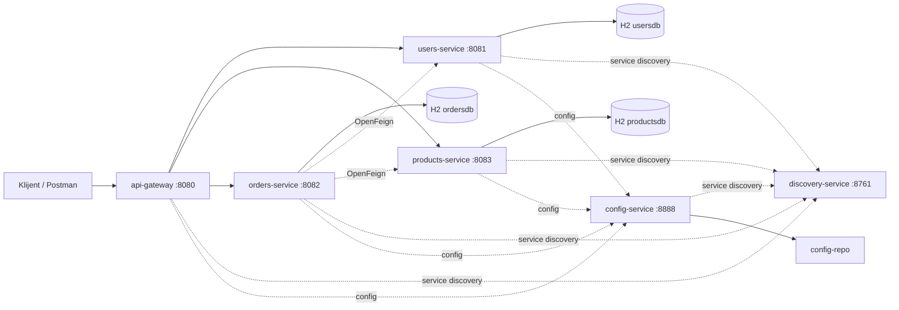

# Mini E-commerce (Microservices)

Ideja ovog projekta jeste da prikaze osnovno obavljanje kupovine, tj. poručivanje koje bi se vršilo preko potencijalne web stranice. 
Zamišljeno je da postoji sledeće:
1. Users service - koji sadrži informacije o korisniku poput imena, prezimena, mejl-a, broja telefona, adrese.
2. Products service - koji sadrži informacije o proizvodu poput naziva, opisa, cene, dostupnosti
3. Orders service - koji sadrži informacije o kupcu, prodavcu, nazivu proizvoda, poručenoj količini, ukupnoj ceni, i status porudžbine.
Ostali parametri koji su neophodni su id-evi, datum kreiranja i izmene. 

## Dijagram komponenti


## Tehnologije koje koristi
- Java 21 (ispunjava zahtev `Java 17+`)
- Spring Boot 3.5.7
- Spring Cloud (Eureka, Gateway, OpenFeign, Config Server)
- Resilience4j (Circuit Breaker + Retry)
- H2
- Docker Compose

## Tabela servisa
| Servis | Port | Glavne rute | Odgovornost |
|---|---:|---|---|
| `discovery-service` | 8761 | `/` (Eureka UI) | Service discovery |
| `config-service` | 8888 | `/` (Config Server) | Centralna konfiguracija |
| `api-gateway` | 8080 | `/api/users/**`, `/api/products/**`, `/api/orders/**` | Jedinstvena ulazna tačka + API key filter |
| `users-service` | 8081 | `/api/users/**` | CRUD korisnika |
| `products-service` | 8083 | `/api/products/**` | CRUD proizvoda + proizvodi po vlasniku |
| `orders-service` | 8082 | `/api/orders/**` | CRUD porudžbina, agregacioni endpoint, buisiness operacija |

## Šta je urađeno od obaveznih stavki
- Eureka discovery + registracija servisa
- API Gateway
- Mikroservisi (`users`, `orders`) + proširenje sa `products`
- OpenFeign komunikacija (`orders -> users`, `orders -> products`)
- Resilience4j (`CircuitBreaker + Retry`) za Feign pozive
- H2 po servisu
- Agregacioni endpoint: `GET /api/orders/{id}/details` koji spaja users i product u order
- Validacija + korektni HTTP statusi

## Bonus delovi koji su urađeni
- Spring Cloud Config Server + `config-repo` iz kojeg uzimamo konfiguraciju za servise
- Docker Compose
- API key autentikacija na gateway-u

## Neka od pravila
- Kupac ne može naručiti svoj proizvod 
- Nije dozvoljena kupovina proizvoda koji nije dostupan (`available=false`)
- Ako korisnik/proizvod ne postoji 
- Ako eksterni servis padne  (`Users service unavailable`, `Products service unavailable`)
- `PUT /api/orders/{id}` dozvoljava samo `quantity` i `status`, slanje drugih polja (`itemName`, `totalPrice`, ...) nije dozvoljeno i vratiće upozorenje

## Pokretanje (Docker Compose)
Iz mini-ecommerce foldera:
```bash
docker compose up --build
```

## API key
Za pozive kroz gateway koristiti header:
- `X-API-Key: Dk7uG2qv9N1zX4pR8sLm3TqY6aV0cJfH5eW1bK2mP9rS8uG7` i `Content-Type: application/json `
koji je inače definisan kao env varijabla `SECURITY_API_KEY`.
Za potrebe pojedinačnog pokretanja, bez Docker Compose-a, api-key se nalazi `application.yaml` kao fallback vrednost u security.api-key, ili se naravno može dodati kroz env varijablu iz terminala: `$env:SECURITY_API_KEY="Dk7uG2qv9N1zX4pR8sLm3TqY6aV0cJfH5eW1bK2mP9rS8uG7"`

## Pokretanje (lokalno, bez Docker-a za testiranje Resilience4j)
1. `discovery-service`
2. `config-service`
3. `users-service`
4. `products-service`
5. `orders-service`
6. `api-gateway`

Ukucati za svaki servis

```bash
./mvnw spring-boot:run
```

## Primer testiranja
1. Kreirati korisnike (`POST /api/users`)
2. Kreirati proizvode (`POST /api/products`)
3. Kreirati porudžbinu (`POST /api/orders`)
4. Proveriti detalje (`GET /api/orders/{id}/details`)
5. Proveriti seller notifikacije (`GET /api/orders/sellers/{sellerUserId}/notifications`) gde korisnik može pregledati da li ima notifikacije za njegove proizvode, npr. za poručen proizvod
6. Izmeniti porudžbinu (`PUT /api/orders/{id}` sa `quantity`, `status`)

## Testiranje za Feign + CB/Retry
`orders-service` ima nivoe logovanja za:
- Feign klijente (`WARN`)
- Resilience4j CB/Retry (`INFO`)


## Testovi
Primeri testova su dodati u `orders-service`:
- `@WebMvcTest`: `OrderControllerWebMvcTest`
- Servisni test: `OrderServiceTest`

Pokretanje testova:
```bash
cd orders-service
./mvnw test
```
